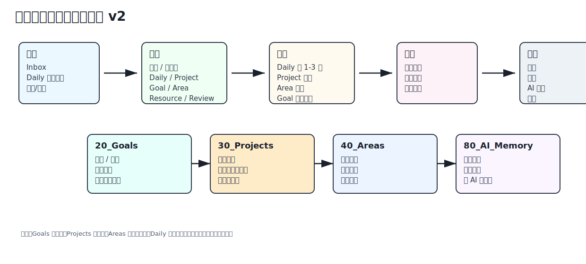
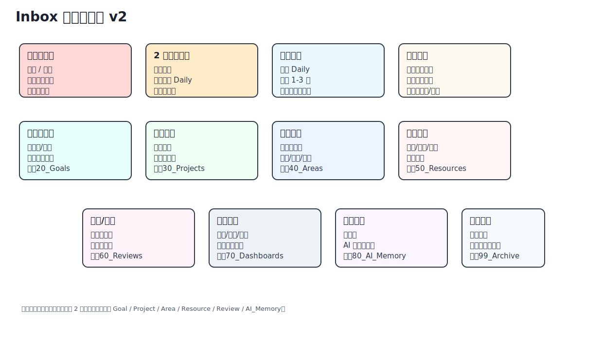

# 任务与记录生命周期



一条内容进入系统后，最终只有这些合理去向：

| 结局 | 去向 | 适合内容 |
| --- | --- | --- |
| 删除 | 不保留 | 过期、重复、无行动/沉淀价值 |
| 当天执行 | `10_Daily` | 今天要做的小任务 |
| 目标/计划 | `20_Goals` | 更大的方向、指标、阶段计划 |
| 项目推进 | `30_Projects` | 多步、有完成标准、有交付物 |
| 长期维护 | `40_Areas` | 没有完成线的责任、习惯、原则 |
| 资料沉淀 | `50_Resources` | 文章、视频、教程、流程、图片 |
| 复盘经验 | `60_Reviews` | 异常、经验、周/月复盘 |
| AI 记忆 | `80_AI_Memory` | 稳定偏好、长期背景、固定流程 |
| 完成历史 | `99_Archive` | 完成项目、过期但要保留的资料 |

## 琐碎事务

能立刻做掉的琐事可以不记录。

写进 Daily 的琐事完成后留在当天 Daily 即可，不需要归档或进入 AI Memory。

```text
Inbox → Daily → 完成 → 留在当天 Daily
```

## 分流判断


