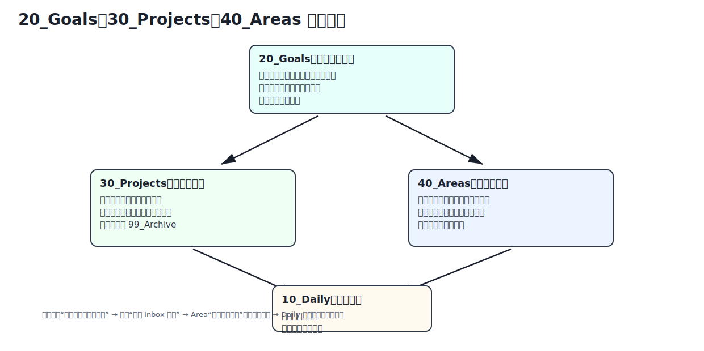

# Goals / Projects / Areas 边界



## 判断口诀

```text
更大方向 + 指标/阶段 = Goal
多步 + 有完成线 + 有交付物 = Project
长期责任 + 没有完成线 = Area
单步但不立刻做 = Daily 或 Area 维护清单
```

## Goal

Goal 回答：

- 为什么做？
- 最终要达到什么状态？
- 用什么指标衡量？
- 会拆出哪些项目？

## Project

Project 回答：

- 这次具体完成什么？
- 完成标准是什么？
- 下一步是什么？
- 做完后如何复盘和归档？

## Area

Area 回答：

- 这个领域如何长期维护？
- 有哪些原则、SOP、维护清单？
- 当前有哪些相关项目？
