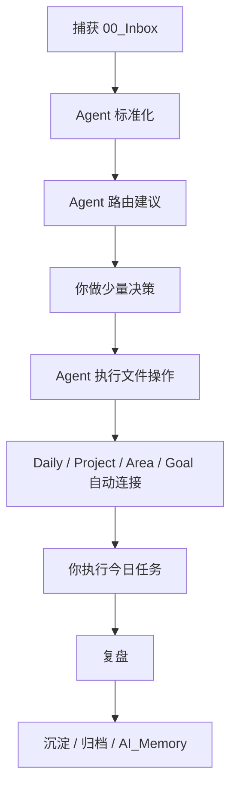

# 新版系统说明｜Agent驱动执行系统

> 当前版本：V2 Agent Router  
> 适用范围：个人任务管理、知识管理、项目推进、复盘沉淀、AI 长期记忆  
> 核心目标：把精力从“手动分类和整理”转移到“少量决策和大量执行”。

## 一句话说明

这个系统不是让你维护更多文件夹，而是让 Obsidian 成为数据底座，让 Agent 参与捕获后的分类、规划、分解和连接；你只负责关键决策和最终执行。



## 三个最重要的动作

| 动作 | 你做什么 | Agent 做什么 |
| --- | --- | --- |
| 捕获 | 把想法、任务、资料先扔进 Inbox | 不要求你当场分类 |
| 执行 | 每天只看 Daily 和少数项目下一步 | 把 Inbox 内容路由到正确位置，生成下一步 |
| 复盘 | 判断完成、继续、延期、删除、沉淀 | 提炼经验、更新项目、归档和生成 AI_Memory 候选 |

## 系统分层

### 1. 数据层：Obsidian

Obsidian 只负责保存结构化结果，不负责逼你在捕获时手动整理。

| 文件夹 | 新版定位 |
| --- | --- |
| `00_Inbox` | 原始捕获和待路由内容。这里不是家，只是入口。 |
| `10_Daily` | 今日执行台。每天最多承载 1-3 个关键任务。 |
| `20_Goals` | 方向、指标、阶段目标。回答“为什么做、做到什么程度”。 |
| `30_Projects` | 多步、有完成线、有交付物的项目主线。 |
| `40_Areas` | 长期责任、维护清单、SOP、项目索引。 |
| `50_Resources` | 外部资料、教程、流程、素材。 |
| `60_Reviews` | 复盘、异常经验、可复用教训。 |
| `70_Dashboards` | 只看不录入，包含 Inbox 处理台和任务总览。 |
| `80_AI_Memory` | 给 AI 的稳定摘要，不放原始流水账。 |
| `90_Templates` | Daily、项目、复盘、Agent 输出模板。 |
| `99_Archive` | 完成或过期但要保留的历史。 |

### 2. 处理层：Agent

Agent 可以来自 Codex、ChatGPT、Claude、本地模型、Dify、n8n 或未来的自动化脚本。模型可以换，但输入输出协议不换。

| Agent 角色 | 负责什么 | 不负责什么 |
| --- | --- | --- |
| Capture Normalizer | 拆分、清洗、去重，把原始捕获变成标准卡片 | 不做最终文件操作 |
| Inbox Router | 判断立即执行、分步项目、丢弃、资料、复盘、AI 记忆候选 | 不替你做价值判断的最终拍板 |
| Decision Assistant | 只在不确定时问 1-3 个问题 | 不把问题扩散成复杂访谈 |
| Project Planner | 为分步事项生成项目 Hub、阶段、下一步行动 | 不做宏大空泛规划 |
| Linker | 自动挂 Goal、Area、Project、Resource 链接和元数据 | 不复制同一批任务到多个地方 |
| Daily Executor | 从项目中抽取今日 1-3 个下一步 | 不把所有待办塞进今天 |
| Review Agent | 晚间/周复盘，提炼经验和后续动作 | 不记录无意义流水账 |
| Archivist | 项目完成后归档、总结、保留可复用结论 | 不删除未经确认的内容 |

### 3. 决策层：你

你不再做大量“搬文件”的动作，只做少量高价值判断。

你每天主要判断：

- 接受 Agent 的建议。
- 修改去向。
- 丢弃。
- 合并到已有项目。
- 新建项目。
- 推迟处理。
- 要不要进入 AI_Memory 候选。

### 4. 执行层：Daily 和 Project

执行永远回到两个位置：

- 今天做：`10_Daily/当天日期.md`
- 分步推进：`30_Projects/具体项目/README.md` 或项目任务池

Goal、Area、Resource、Review、AI_Memory 都是支撑层，不应该成为每天执行时反复切换的主界面。

## 新版生命周期

```text
捕获 → 标准化 → Agent 路由 → 人类确认 → 自动写入/连接 → Daily 执行 → 复盘 → 沉淀/归档/删除
```

一条内容进入系统后，先不问“文件夹在哪里”，而是问三件事：

1. 这是要行动的事吗？
2. 能不能立即或今天完成？
3. 如果不能，它是已有项目、新项目、长期维护、资料、经验，还是应该丢弃？

## 新版分类结果

| 路由结果 | 去向 | 说明 |
| --- | --- | --- |
| `do_now` | 直接做或写入今天 Daily | 两分钟内可完成，或今天必须做 |
| `daily` | `10_Daily` | 单步任务，但不是立刻做 |
| `existing_project` | 既有 Project Hub | 多步事项，属于已有项目 |
| `new_project` | 新建 Project Hub | 多步、有完成线、有交付物 |
| `area_maintenance` | `40_Areas` | 长期维护、习惯、SOP、周期任务 |
| `goal_or_plan` | `20_Goals` | 方向、指标、阶段计划 |
| `resource` | `50_Resources` | 外部资料、教程、流程、参考链接 |
| `review` | `60_Reviews` | 异常、经验、复盘材料 |
| `ai_memory_candidate` | `80_AI_Memory/候选` 或项目摘要 | 稳定偏好、长期背景、固定流程 |
| `discard` | 删除或丢弃记录 | 过期、重复、无行动/沉淀价值 |

## 自动连接原则

新版系统不要求你在 Goal、Area、Project 之间手动来回贴链接。项目用 frontmatter 或固定字段表达关系，仪表盘和 Agent 再按关系聚合。

```md
---
type: project
status: active
area: 个人执行系统
goal: 建立低摩擦任务管理与知识管理系统
next_action: 定义 Inbox Router 的处理规则
review_cycle: weekly
---
```

连接规则：

- Project 是执行主线。
- Area 只挂索引和长期规则。
- Goal 只挂方向、指标和项目列表。
- Daily 只承载今天真正要执行的下一步。
- AI_Memory 只保存稳定摘要和长期偏好。

## 旧版系统如何处理

V1 的核心是“手动分类”：你根据规则把 Inbox 内容搬到不同文件夹。它的价值是定义了 Goals / Projects / Areas / Resources / Reviews / AI_Memory 的边界。

V2 不否定这些边界，但把操作方式改成：

```text
旧版：我判断 → 我移动 → 我建链接 → 我执行
新版：Agent 建议 → 我确认 → Agent 写入和连接 → 我执行
```

旧版规则现在只作为历史记录和边界参考，不再作为日常操作的主流程。


---


# 新版使用说明｜Agent协作流程

> 使用目标：每天少整理，多执行。  
> 默认入口：`00_Inbox/收件箱.md`、`70_Dashboards/Inbox处理台.md`、当天 Daily Note。

## 每天怎么用

### 早上：确定今日执行

1. 打开当天 Daily Note。
2. 打开 [[../../../../70_Dashboards/Inbox处理台]]。
3. 如果 Inbox 有新内容，对 Agent 说：

```text
请按新版 Agent 路由协议处理 你的 Obsidian Vault/00_Inbox\收件箱.md。
先给我路由建议表，不要执行文件操作。
每条最多问 1 个必要问题。
```

4. 你只做决策：

```text
接受第 1、3、5 条。
第 2 条并入“长期探索｜任务管理与知识管理”项目。
第 4 条丢弃。
第 6 条改成资料，放 Resources。
```

5. Agent 再执行文件操作：

```text
按我刚才确认的决策执行：写入 Daily、更新项目任务池、创建必要链接，并把 Inbox 中已处理内容标记为已处理。
```

### 白天：只执行

执行时只看两个地方：

- 当天 Daily Note 顶部的 1-3 件关键任务。
- 当前项目 Hub 的下一步行动。

不要在执行时重新设计系统、调插件、改目录。系统优化统一放到周复盘或专门项目里。

### 晚上：5 分钟复盘

对 Agent 说：

```text
请根据今天 Daily Note 做晚间复盘：
1. 完成了什么
2. 没完成的任务如何处理
3. 哪些经验值得进入 Reviews
4. 哪些稳定规则适合进入 AI_Memory 候选
先给建议，不要直接改文件。
```

你确认后，Agent 再写入 Reviews、AI_Memory 候选或项目日志。

### 周日：30 分钟整理

周复盘只处理四件事：

1. 清空 Inbox。
2. 检查 Projects 是否都有下一步。
3. 检查 Areas 是否有长期维护任务。
4. 把稳定经验沉淀到 Reviews / Resources / AI_Memory。

## 你需要做的决策

每条捕获内容只允许进入以下决策之一：

| 决策 | 什么时候用 |
| --- | --- |
| 接受建议 | Agent 判断合理 |
| 修改去向 | 大方向对，但文件夹或项目错了 |
| 合并项目 | 属于已有 Project Hub |
| 新建项目 | 多步、有完成线、没有合适项目 |
| 今日执行 | 单步且今天要做 |
| 推迟处理 | 当前信息不足，但暂时不删除 |
| 丢弃 | 无价值、重复、过期 |
| 再问模型 | 高风险、复杂或你不确定 |

## Agent 处理 Inbox 的建议表

Agent 每次处理 Inbox，应该先输出这样的表，而不是直接改文件。

| 编号 | 原文 | 建议去向 | 理由 | 下一步 | 需要你确认 |
| --- | --- | --- | --- | --- | --- |
| I001 | 服务器购买部署、Obsidian 同步、图床方案 | new_project | 多步、有交付物、涉及技术决策 | 新建“个人基础设施与同步方案”项目 | 是否作为当前大项目子项目？ |
| I002 | 买电动行李箱 | daily | 单步购买决策 | 今天查 3 个型号 | 是否今天处理？ |
| I003 | 这个链接可能有用 | discard | 无摘要、无项目关联 | 删除 | 无 |

你确认后，Agent 才能执行操作。

## 示例 1：立即执行

捕获：

```md
- 买打印纸
```

Agent 建议：

```json
{
  "route": "daily",
  "next_action": "今天下单或加入购物清单",
  "operations": [
    {"type": "append_daily_task", "task": "买打印纸"}
  ]
}
```

你确认后，Agent 写入当天 Daily。完成后留在当天 Daily，不进入归档。

## 示例 2：进入已有项目

捕获：

```md
- 优化任务管理系统，让 Agent 自动分类和连接
```

Agent 建议：

```json
{
  "route": "existing_project",
  "project": "长期探索｜任务管理与知识管理",
  "next_action": "写出 Agent 路由系统说明和使用说明",
  "operations": [
    {"type": "append_project_task", "path": "30_Projects/长期探索｜任务管理与知识管理/01_任务池.md"},
    {"type": "append_daily_task", "task": "确认 Agent 路由系统的第一版规则"}
  ]
}
```

你只需要确认它是否确实归入当前大项目。

## 示例 3：新建项目

捕获：

```md
- 买房相关事宜：问户型、价格、环境，比较几个盘
```

判断：

- 多步。
- 有阶段性完成线。
- 需要资料、比较、决策、家人沟通。

建议去向：

```text
30_Projects/买房信息收集与比较/README.md
```

Agent 应自动创建 Project Hub，并挂到合适 Area：

```md
---
type: project
status: active
area: 家庭与生活
goal:
next_action: 列出候选楼盘和需要询问的问题
---
```

Area 里只挂项目索引，不重复写完整任务。

## 示例 4：资料沉淀

捕获：

```md
- 一篇讲 Obsidian Tasks 查询语法的文章
```

Agent 不应该只存链接，而应该建议：

1. 放入 `50_Resources/工具与流程`。
2. 提取对你有用的 3-5 条。
3. 如果产生行动，再生成任务。

## 示例 5：AI_Memory 候选

捕获：

```md
- 我发现自己总是在整理工具上花太多时间，反而不执行。
```

Agent 应判断为复盘经验，先进入 Reviews。只有反复出现并形成稳定规则后，才进入 AI_Memory。

AI_Memory 写法应是提炼后的稳定摘要：

```md
用户容易在工具优化上消耗执行精力。建议工作日优先保护 Daily Note 的第一任务，把系统优化放到周复盘或专门项目中处理。
```

## 不同 Agent 怎么配合

| 工具/模型 | 适合做什么 | 注意 |
| --- | --- | --- |
| Codex | 读取/修改本地 Obsidian 文件、创建项目、更新链接、Git 版本管理 | 执行前先给建议，破坏性操作必须确认 |
| ChatGPT / Claude | 分类建议、规划、复盘提炼、复杂问题讨论 | 通常不能直接操作你的文件 |
| 本地模型 | 隐私内容初筛、低成本分类 | 输出质量不足时交给强模型复核 |
| Dify / n8n | 固定流程自动化、定时处理、Webhook | 必须遵守同一输入输出协议 |

## 给 Agent 的固定提示词

### 只分析不执行

```text
你是我的 Inbox Router。请按 Agent 工作流协议处理下面内容。
目标是减少我的分类成本，把精力留给执行。
请输出路由建议表，每条包含：建议去向、理由、下一步、需要我确认的问题。
不要直接执行文件操作。
```

### 执行已确认决策

```text
请根据我确认的决策执行文件操作。
要求：
1. 保留原始内容的可追溯痕迹。
2. 自动创建必要链接和 frontmatter。
3. Project 是执行主线，Area/Goal 只挂索引。
4. 删除、覆盖、归档前再次确认。
5. 执行后更新项目日志和版本记录。
```

### 晚间复盘

```text
请根据今天 Daily Note 和相关项目任务，生成晚间复盘建议。
请区分：继续执行、拆小、延期、删除、沉淀到 Reviews、进入 AI_Memory 候选。
先给建议，不直接改文件。
```

## 版本备份怎么用这些说明

每次系统升级前，保留：

- 当前系统说明。
- 当前使用说明。
- 当前 Agent 工作流协议。
- 当前 Inbox 路由规则。
- 当前目录结构快照。

备份后新版可以覆盖主说明，但旧版必须放入 `10_沉淀/历史版本`，只作为记录，不再作为日常操作入口。
