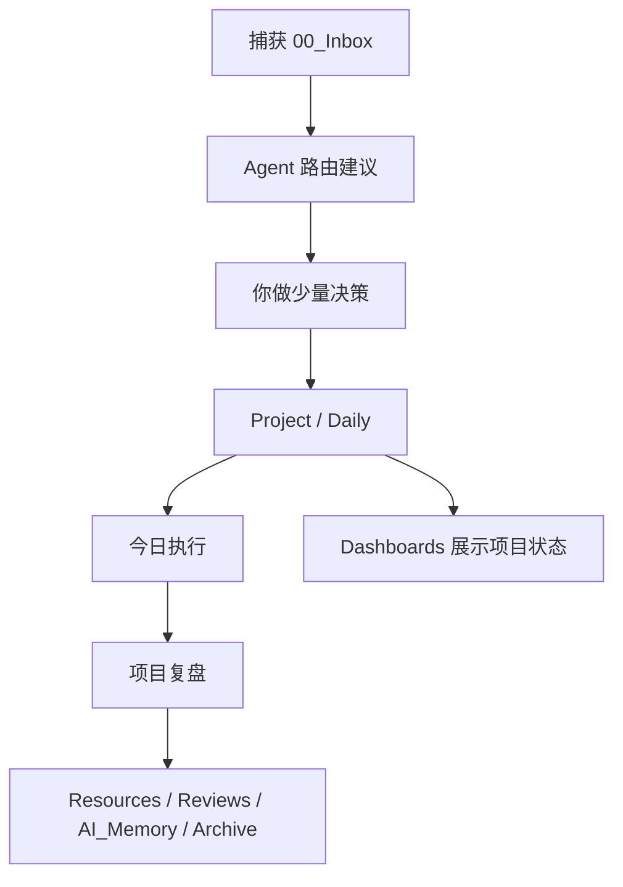

# 新版系统说明｜Agent驱动执行系统

> 当前版本：V2.1 Project Execution Center  
> 适用范围：个人任务管理、知识管理、项目推进、复盘沉淀、AI 长期记忆  
> 核心目标：围绕执行和项目展开，把分类、展示、资料和 AI 记忆都变成项目推进的支撑。

## 一句话说明

这个系统不是让你维护更多文件夹，而是让 Obsidian 成为数据底座，让 Agent 参与捕获后的分类、规划、分解和连接；你负责关键决策和最终执行。



## 执行中心准则

系统中心只有两个：

- `10_Daily`：今天做什么。
- `30_Projects`：分步事项如何推进。

其他所有部分都是支撑层：

- `00_Inbox` 负责捕获。
- `20_Goals` 负责方向和验收指标。
- `40_Areas` 负责长期责任、SOP 和项目索引。
- `50_Resources` 负责资料。
- `60_Reviews` 负责复盘经验。
- `70_Dashboards` 负责展示项目状态和辅助决策。
- `80_AI_Memory` 负责给 AI 的稳定摘要。

## 三个最重要的动作

| 动作 | 你做什么 | Agent 做什么 |
| --- | --- | --- |
| 捕获 | 把想法、任务、资料先扔进 Inbox | 不要求你当场分类 |
| 执行 | 每天只看 Daily 和项目下一步 | 把分步事项转为 Project，把下一步转为 Daily |
| 复盘 | 判断完成、继续、延期、删除、沉淀 | 提炼经验、更新项目、归档和生成 AI_Memory 候选 |

## 系统分层

| 文件夹 | 新版定位 |
| --- | --- |
| `00_Inbox` | 原始捕获和待路由内容。这里不是家，只是入口。 |
| `10_Daily` | 今日执行台。每天最多承载 1-3 个关键任务。 |
| `20_Goals` | 方向、指标、阶段目标。回答“为什么做、做到什么程度”。 |
| `30_Projects` | 多步、有完成线、有交付物的项目主线。 |
| `40_Areas` | 长期责任、维护清单、SOP、项目索引。 |
| `50_Resources` | 外部资料、教程、流程、素材。 |
| `60_Reviews` | 复盘、异常经验、可复用教训。 |
| `70_Dashboards` | 项目、任务、目标和数据展示，用于决策，不用于录入。 |
| `80_AI_Memory` | 给 AI 的稳定摘要，不放原始流水账。 |
| `90_Templates` | Daily、项目、复盘、Agent 输出模板。 |
| `99_Archive` | 完成或过期但要保留的历史。 |

## Agent 角色

Agent 可以来自 Codex、ChatGPT、Claude、本地模型、Dify、n8n 或未来的自动化脚本。模型可以换，但输入输出协议不换。

| Agent 角色 | 负责什么 |
| --- | --- |
| Capture Normalizer | 拆分、清洗、去重，把原始捕获变成标准卡片 |
| Inbox Router | 判断立即执行、分步项目、丢弃、资料、复盘、AI 记忆候选 |
| Project Planner | 为分步事项生成项目 Hub、完成标准和下一步行动 |
| Linker | 自动挂 Goal、Area、Project、Resource 链接和元数据 |
| Daily Executor | 从项目中抽取今日 1-3 个下一步 |
| Review Agent | 晚间/周复盘，提炼经验和后续动作 |
| Archivist | 项目完成后归档、总结、保留可复用结论 |

## 新版生命周期

```text
捕获 → Agent 路由 → 用户确认 → Project / Daily → 执行 → 复盘 → 沉淀/归档/删除
```

一条内容进入系统后，先问三件事：

1. 能不能今天做完？
2. 如果不能，是否应该进入已有项目或新项目？
3. 如果没有行动价值，是否应该丢弃？

## 自动连接原则

项目用 frontmatter 或固定字段表达关系，仪表盘和 Agent 再按关系聚合。

```md
---
type: project
status: active
area: 个人执行系统
goal: 建立低摩擦任务管理与知识管理系统
next_action: 定义 Inbox Router 的处理规则
review_cycle: weekly
---
```

连接规则：

- Project 是执行主线。
- Area 只挂索引和长期规则。
- Goal 只挂方向、指标和项目列表。
- Daily 只承载今天真正要执行的下一步。
- Dashboard 只展示，不承载任务正文。
- AI_Memory 只保存稳定摘要和长期偏好。

## 旧版系统如何处理

V1 的核心是手动分流；V2 的核心是 Agent 路由；V2.1 进一步明确：路由只是前置处理，系统最终必须回到 Project 和 Daily。


---


# 新版使用说明｜Agent协作流程

> 使用目标：每天少整理，多执行。  
> 默认入口：当天 Daily Note 和 `70_Dashboards/项目推进台`。

## 每天怎么用

### 早上：确定今日执行

1. 打开当天 Daily Note。
2. 打开 [[../../../../70_Dashboards/项目推进台]]。
3. 从项目下一步里选 1-3 件写进 Daily 顶部。
4. 只有 Inbox 内容会影响今天执行时，才打开 [[../../../../70_Dashboards/Inbox处理台]]。

给 Agent 的提示词：

```text
请按执行中心原则检查我的项目推进状态。
优先看 30_Projects，不要先处理 Inbox。
请告诉我：哪些项目没有下一步、哪些任务应该进入今天 Daily、哪些任务太大需要拆小。
先给建议表，不要直接改文件。
```

### 白天：只执行

执行时只看两个地方：

- 当天 Daily Note 顶部的 1-3 件关键任务。
- 当前项目 Hub 的下一步行动。

不要在执行时重新设计系统、调插件、改目录。系统优化统一放到周复盘或专门项目里。

### 处理 Inbox：只在需要时

Inbox 不是每日必看的任务清单。它只在这些时候处理：

- 有捕获内容影响今天执行。
- 周日清空 Inbox。
- 需要把新想法转成项目。

```text
请按执行中心原则和 Agent 路由协议处理 Inbox。
目标是把分步事项转成 Project，把今天能做的转成 Daily，把无价值内容丢弃。
先给建议表，不要直接改文件。
```

### 晚上：5 分钟复盘

对 Agent 说：

```text
请根据今天 Daily Note 和当前项目任务做晚间复盘：
1. 完成了什么
2. 没完成的任务如何处理
3. 哪些项目下一步需要更新
4. 哪些经验值得进入 Reviews
5. 哪些稳定规则适合进入 AI_Memory 候选
先给建议，不要直接改文件。
```

### 周日：30 分钟整理

周复盘只处理四件事：

1. 用 [[../../../../70_Dashboards/Inbox处理台]] 清空 Inbox。
2. 用 [[../../../../70_Dashboards/项目推进台]] 检查 Projects 是否都有下一步。
3. 检查 Areas 是否有长期维护任务。
4. 把稳定经验沉淀到 Reviews / Resources / AI_Memory。

## 你需要做的决策

每条捕获内容只允许进入以下决策之一：

| 决策 | 什么时候用 |
| --- | --- |
| 今日执行 | 单步且今天要做 |
| 合并项目 | 属于已有 Project Hub |
| 新建项目 | 多步、有完成线、没有合适项目 |
| 接受建议 | Agent 判断合理 |
| 修改去向 | 大方向对，但项目或支撑层错了 |
| 推迟处理 | 当前信息不足，但暂时不删除 |
| 丢弃 | 无价值、重复、过期 |
| 再问模型 | 高风险、复杂或你不确定 |

## 不同 Agent 怎么配合

| 工具/模型 | 适合做什么 | 注意 |
| --- | --- | --- |
| Codex | 读取/修改本地 Obsidian 文件、创建项目、更新链接、Git 版本管理 | 执行前先给建议，破坏性操作必须确认 |
| ChatGPT / Claude | 分类建议、规划、复盘提炼、复杂问题讨论 | 通常不能直接操作你的文件 |
| 本地模型 | 隐私内容初筛、低成本分类 | 输出质量不足时交给强模型复核 |
| Dify / n8n | 固定流程自动化、定时处理、Webhook | 必须遵守同一输入输出协议 |

## 版本备份怎么用这些说明

每次系统升级前，保留：

- 当前系统说明。
- 当前使用说明。
- 当前执行中心原则。
- 当前 Agent 工作流协议。
- 当前 Inbox 路由规则。
- 当前目录结构快照。

备份后新版可以覆盖主说明，但旧版必须放入 `10_沉淀/历史版本`，只作为记录，不再作为日常操作入口。
