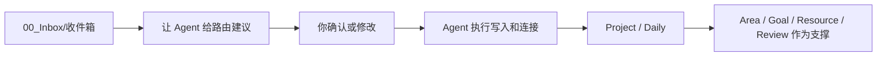

# Inbox处理台

这个页面用于让 Agent 处理捕获内容。它不是默认执行入口，也不是另一个任务清单。

## 什么时候打开

- Inbox 里有新内容，并且影响当前执行。
- 周日要清空 Inbox。
- 想让 Agent 把捕获内容拆成项目、下一步和链接。

日常默认执行入口是 [[项目推进台]] 和当天 Daily Note。

## 当前处理流程



## 给 Agent 的提示词

### 只给建议

```text
请按执行中心原则和 Agent 路由协议处理 你的 Obsidian Vault\00_Inbox\收件箱.md。
目标是把分步事项尽快转成 Project，把今天能做的转成 Daily，把无价值内容丢弃。
请先输出路由建议表，不要执行文件操作。
每条包含：编号、原文、是否需要项目、建议去向、下一步、需要我确认的问题。
```

### 执行确认结果

```text
请按我确认的路由结果执行文件操作：
1. 分步事项优先写入 Project。
2. 今日行动写入 Daily。
3. Area/Goal 只挂索引和约束，不复制项目正文。
4. Resources/Reviews/AI_Memory 只保存支撑资料、复盘和稳定摘要。
5. 删除、归档、覆盖前再次确认。
6. 执行后告诉我更新了哪些文件，以及今天下一步是什么。
```

## 建议表模板

| 编号 | 原文 | 是否需要项目 | 建议去向 | 下一步 | 需确认 |
| --- | --- | --- | --- | --- | --- |
| I001 |  |  |  |  |  |

## 决策口令

```text
接受第 1、3 条。
第 2 条并入已有项目“长期探索｜任务管理与知识管理”。
第 4 条新建项目，归属 Area“家庭与生活”。
第 5 条丢弃。
先不要处理第 6 条。
```

## 相关说明

- [[../30_Projects/长期探索｜任务管理与知识管理/10_沉淀/执行中心原则]]
- [[../30_Projects/长期探索｜任务管理与知识管理/10_沉淀/新版系统说明｜Agent驱动执行系统]]
- [[../30_Projects/长期探索｜任务管理与知识管理/10_沉淀/Agent工作流协议]]
- [[../30_Projects/长期探索｜任务管理与知识管理/10_沉淀/Inbox路由器规则]]
