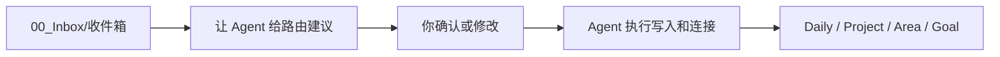

# Inbox处理台

这个页面是新版系统的日常入口之一，用来让 Agent 处理捕获内容。它不是另一个任务清单，而是“捕获 → 决策 → 自动连接”的控制台。

## 什么时候打开

- Inbox 里有新内容，不想手动分类时。
- 早上要确定今天 1-3 件任务时。
- 周日要清空 Inbox 时。
- 想让 Agent 把捕获内容拆成项目、下一步和链接时。

## 当前处理流程



## 给 Agent 的提示词

### 只给建议

```text
请按新版 Agent 路由协议处理 你的 Obsidian Vault/00_Inbox\收件箱.md。
目标是减少我的分类成本，把精力留给执行。
请先输出路由建议表，不要执行文件操作。
每条包含：编号、原文、建议去向、理由、下一步、需要我确认的问题。
```

### 执行确认结果

```text
请按我确认的路由结果执行文件操作：
1. 写入 Daily、Project、Area、Goal、Resources、Reviews 或 AI_Memory 候选。
2. 自动创建必要链接和 frontmatter。
3. Project 是执行主线，Area/Goal 只挂索引。
4. 删除、归档、覆盖前再次确认。
5. 执行后告诉我更新了哪些文件和今天下一步是什么。
```

### 晚间复盘

```text
请根据今天 Daily Note 和项目任务，生成复盘建议。
区分：继续执行、拆小、延期、删除、沉淀到 Reviews、进入 AI_Memory 候选。
先给建议，不直接改文件。
```

## 建议表模板

| 编号 | 原文 | 建议去向 | 目标位置 | 下一步 | 需确认 |
| --- | --- | --- | --- | --- | --- |
| I001 |  |  |  |  |  |

## 决策口令

你可以直接这样回复 Agent：

```text
接受第 1、3 条。
第 2 条并入已有项目“长期探索｜任务管理与知识管理”。
第 4 条新建项目，归属 Area“家庭与生活”。
第 5 条丢弃。
先不要处理第 6 条。
```

## 相关说明

- [[../30_Projects/长期探索｜任务管理与知识管理/10_沉淀/新版系统说明｜Agent驱动执行系统]]
- [[../30_Projects/长期探索｜任务管理与知识管理/10_沉淀/新版使用说明｜Agent协作流程]]
- [[../30_Projects/长期探索｜任务管理与知识管理/10_沉淀/Agent工作流协议]]
- [[../30_Projects/长期探索｜任务管理与知识管理/10_沉淀/Inbox路由器规则]]
